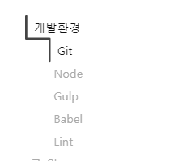
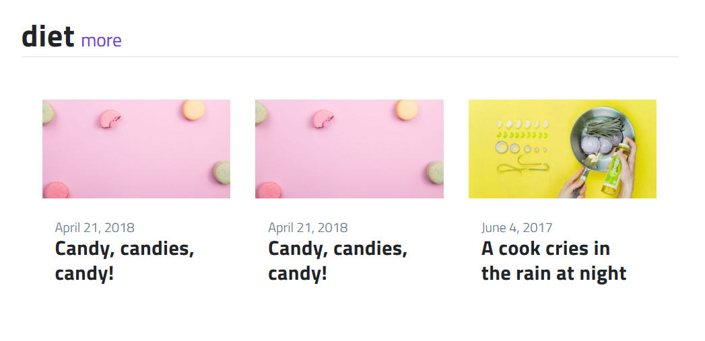
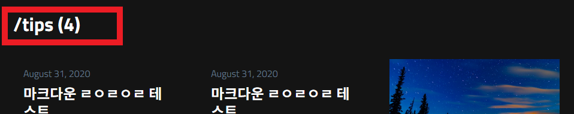
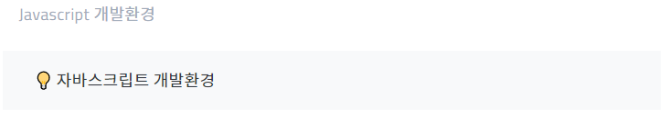

# TIL, Tech blog

Sunmon's TIL(Today I Learn), Tech blog

지식의 노드를 정리합니다.

사이트 주소: https://sunmon.github.io

## Theme

이 사이트는 ***[jetflix Theme](https://github.com/thiagorossener/jekflix-template)*** 을 기반으로 만들었습니다.
<br>
<br>
  
## 추가한 기능

테마에 덧붙여 제가 따로 추가한 기능입니다.

<br>

### 1.형광펜

색상은 ***[open color](https://yeun.github.io/open-color/)*** 를 참고하였습니다.


  
사용법:

```html
<span class="ud-[색상]">형광펜입니다</span>
<span class="ud"> 기본 형광펜 => 바이올렛 </span>
```
<br>
<br>

  
### 2.TOC (Table-Of-Contents)

목차입니다. 

오픈소스 ***[progress-nav](https://github.com/hakimel/css/tree/master/progress-nav)*** 와 ***[jekyll-toc](https://github.com/allejo/jekyll-toc)*** 를 이용했습니다.
  



사용법:

`posts.yml`에서 `side_toc:true` 옵션을 줍니다.

<br>

### 3.Category 모아보기

카테고리를 모아보는 화면입니다.

카테고리별로 최근글을 3개까지 보여줍니다.



<br>


### 4.카테고리별 포스팅 개수 

카테고리별 포스팅 개수를 보여줍니다




### 5.callout

노션에 있는 callout이 이뻐서 만들었습니다.



사용법:
```html
<p class="callout"> 💡 Callout something! </p>
```
